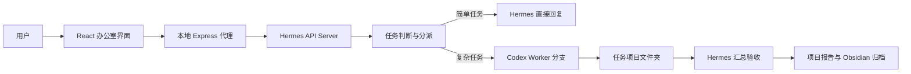

# Hermes Agent Office

一个 Marvis 风格的本地 Agent 办公室界面。它把 Hermes 作为产品经理、记忆与日常对话入口，把其他 Agent 作为由 Codex CLI 驱动的真实 worker 分支，用来完成文件整理、应用开发、搜索调研、本机执行等任务。

## 核心思路

- Hermes Agent：负责接收任务、判断复杂度、分派 worker、汇总结果、生成最终报告。
- Codex Worker：File Agent、App Agent、Browser Agent、Computer Agent、Search Agent 通过本机 `codex exec` 在独立分支目录中执行任务。
- 本地 Node 代理：读取 `.env` 中的 Hermes API key，并代理 Hermes API 与 Codex worker 调用，前端不接触密钥。
- Obsidian 归档：最终报告会保存到指定 Obsidian 目录，文件名按日期和任务名生成。



## 功能

- Marvis 风格 2x3 办公室工位布局。
- 点击工位查看 Agent 详情、配置文档、技能列表、工作记录和即时对话。
- Hermes 简单对话不派发 worker。
- 复杂任务由 Hermes 决定是否派发，以及派发给哪些 worker。
- 每个 worker 使用独立项目分支目录保存提示、日志、结果和证据。
- 最终报告同时保存到任务项目目录和 Obsidian 报告目录。

## 技术栈

- Vite
- React
- TypeScript
- Express
- Hermes API Server
- Codex CLI

## 前置要求

1. 已安装 Node.js 与 npm。
2. 已安装并登录 Codex CLI，终端中可以运行：

```powershell
codex --version
```

3. 已启用 Hermes API Server，并启动 Hermes gateway：

```powershell
hermes gateway
```

4. Hermes gateway 默认监听：

```text
http://127.0.0.1:8642
```

## 环境变量

复制示例文件：

```powershell
copy .env.example .env
```

然后编辑 `.env`：

```env
HERMES_API_BASE=http://127.0.0.1:8642
HERMES_API_KEY=replace-with-your-API_SERVER_KEY
OFFICE_PROXY_PORT=8787
HERMES_OFFICE_PROJECTS_DIR=./projects
OBSIDIAN_REPORT_DIR=./obsidian-reports
CODEX_WORKER_ENABLED=true
CODEX_CLI_COMMAND=codex
CODEX_WORKER_TIMEOUT_MS=600000
CODEX_WORKER_SANDBOX=danger-full-access
CODEX_WORKER_MODEL=
```

说明：

- `HERMES_API_KEY` 只保存在本地 `.env`，不会提交到 git。
- `HERMES_OFFICE_PROJECTS_DIR` 是任务项目、worker 分支和程序产物保存目录。
- `OBSIDIAN_REPORT_DIR` 是最终报告归档目录。
- `CODEX_WORKER_SANDBOX=danger-full-access` 用于避免 Windows 下 Codex worker 的 PowerShell 沙箱执行问题。只建议在可信本机项目中使用。
- `CODEX_WORKER_MODEL` 留空时使用当前 Codex CLI 默认模型或配置。

## 启动

安装依赖：

```powershell
npm install
```

启动开发环境：

```powershell
npm run dev
```

打开：

```text
http://127.0.0.1:5173/
```

构建检查：

```powershell
npm run build
```

## 使用方式

1. 打开页面后点击 Hermes 工位。
2. 输入简单问题，例如：

```text
hello，简单介绍一下你的职责。
```

预期：只由 Hermes 回复，不创建 Codex worker 分支。

3. 输入复杂任务，例如：

```text
帮我写一个简单的网页 Todo 应用，要求有新增、完成、删除、筛选和 localStorage 持久化。代码保存在本次任务的 programs 文件夹里，最后由 Hermes 汇总报告。
```

预期：

- Hermes 先判断任务复杂度。
- Hermes 只派发必要的 Codex worker。
- worker 在任务项目文件夹下创建分支并执行。
- 程序代码保存在 `programs`。
- 最终报告保存在 `reports/final-report.md` 和 Obsidian 目录。

## 任务目录结构

每个复杂任务会在 `HERMES_OFFICE_PROJECTS_DIR` 下创建一个项目文件夹：

```text
任务项目/
  00-hermes/
    task-brief.md
  branches/
    File-Agent-file-agent/
      brief.md
      codex-prompt.md
      codex-final.md
      codex-run.json
      codex-stdout.jsonl
      codex-stderr.log
  programs/
    README.md
  reports/
    final-report.md
    source-materials.md
```

说明：

- `00-hermes` 保存 Hermes 总控任务说明。
- `branches` 保存每个 Codex worker 的独立执行记录。
- `programs` 保存 worker 生成的程序、脚本、网页或 demo。
- `reports` 保存最终报告和资料整合。

## 本地代理接口

前端只访问本地代理，不直接访问 Hermes key。

- `GET /api/hermes/health`
- `GET /api/hermes/capabilities`
- `GET /api/hermes/skills`
- `GET /api/hermes/toolsets`
- `POST /api/agents/:agentId/message`
- `GET /api/agents/:agentId/messages`
- `POST /api/workflows`
- `POST /api/workflows/:workflowId/finalize`
- `POST /api/codex/workers/run`

## 推荐测试

### 1. 简单对话

```text
hello，简单介绍一下你现在的职责。
```

检查：

- 只调用 Hermes。
- 其他 Agent 不进入 busy。
- 不创建 worker 分支。

### 2. 单 worker 文件任务

```text
帮我整理一个本地项目文件夹命名规范，并保存成一份简短报告。
```

检查：

- 大概率只派发 File Agent。
- 分支目录里有 `codex-final.md` 和运行日志。
- Obsidian 目录出现最终报告。

### 3. 程序生成任务

```text
帮我写一个简单网页计算器，可以做加减乘除，代码保存在项目文件夹里，最后给我报告。
```

检查：

- 程序文件保存在 `programs`。
- worker 结果包含验证说明。
- Hermes 最终报告引用程序路径。

### 4. 多 Agent 协作任务

```text
请调研一下本地优先知识库工具的常见功能，然后结合 Hermes Agent 办公室，设计一个自动归档方案，并写一个最小可用的归档脚本。资料、代码、最终报告都要分目录保存。
```

检查：

- Hermes 是否选择必要 worker，而不是无脑派发全部 Agent。
- Search 或 Browser 分支是否保存资料整合。
- File 或 App 分支是否产出脚本和目录方案。

## 安全与提交规则

不要提交以下文件：

- `.env`
- API key、token、证书、私钥
- `node_modules`
- `dist`
- `output`
- `.playwright-cli`
- 运行日志
- worker 执行产物
- 本地数据库、session、cookie

这些已经写入 `.gitignore`。

第一次提交示例：

```powershell
git add .
git commit -m "initial"
git push -u origin First
```

后续提交示例：

```powershell
git add .
git commit -m "docs: update readme"
git push
```

## 常见问题

### Hermes 显示 offline

检查：

```powershell
hermes gateway
```

并确认 `.env` 中：

```env
HERMES_API_BASE=http://127.0.0.1:8642
HERMES_API_KEY=你的_API_SERVER_KEY
```

### Codex worker 不能执行命令

检查：

```powershell
codex --version
```

如果 Windows 下出现 sandbox 相关问题，确认 `.env`：

```env
CODEX_WORKER_SANDBOX=danger-full-access
```

### 报告没有进入 Obsidian

检查：

```env
OBSIDIAN_REPORT_DIR=./obsidian-reports
```

确认该目录存在，或让程序有权限创建该目录。

## 当前状态

- 默认分支：`First`
- 默认本地前端地址：`http://127.0.0.1:5173/`
- 默认本地代理地址：`http://127.0.0.1:8787`
- 默认 Hermes gateway 地址：`http://127.0.0.1:8642`
